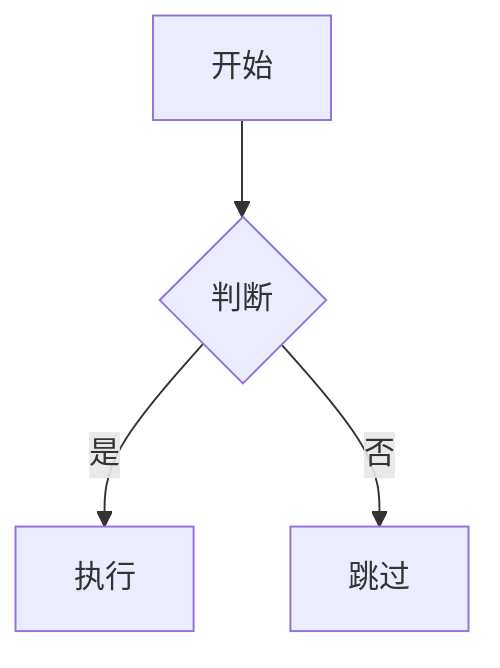

# Mermaid Converter

一个轻量级的 Web 工具，从 Markdown 文件中提取 Mermaid 图表并转换为高清 PNG 图片。

## 功能特性

- **拖拽上传** — 支持 `.md`、`.markdown`、`.txt` 文件
- **自动识别** — 自动提取并识别所有 Mermaid 图表类型
- **实时预览** — 在浏览器中即时渲染图表
- **高清导出** — 以 3 倍分辨率下载 PNG 图片
- **复制到剪贴板** — 一键复制图表
- **批量下载** — 将所有图表打包为 ZIP 文件下载

### 支持的图表类型

流程图、时序图、类图、状态图、ER 图、甘特图、饼图、用户旅程图、Git 图、思维导图、时间线

## 快速开始

无需安装，直接在浏览器中打开 `index.html` 即可使用。

也可以通过本地服务器启动：

```bash
# Python
python3 -m http.server 8000

# Node.js
npx http-server

# 然后访问 http://localhost:8000
```

## 使用方法

1. 拖拽 Markdown 文件到上传区域（或点击选择文件）
2. 预览提取到的图表
3. 单独下载 PNG 或批量打包下载

## 示例

Markdown 文件中需要包含 Mermaid 代码块：

````markdown

````

## 技术栈

- 原生 HTML / CSS / JavaScript（无需构建工具）
- [Mermaid 10](https://mermaid.js.org/) — 图表渲染
- [html2canvas](https://html2canvas.hertzen.com/) — PNG 导出
- [JSZip](https://stuk.github.io/jszip/) — ZIP 打包

## 许可证

MIT
