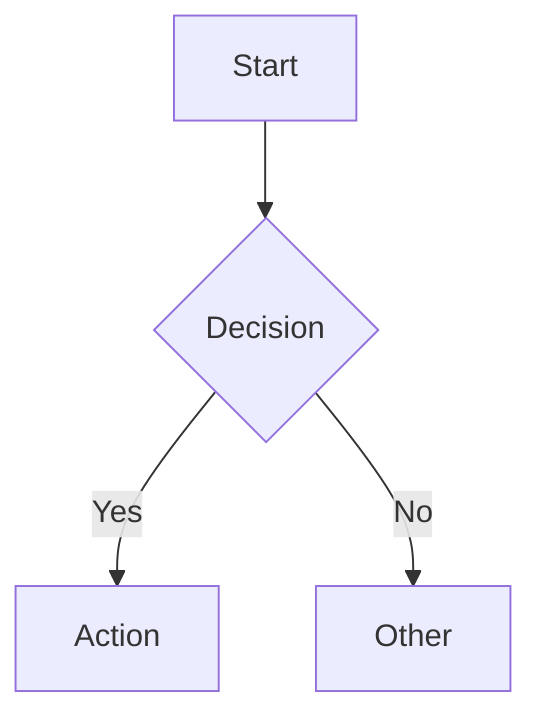

# Mermaid Converter

A lightweight web tool that extracts Mermaid diagrams from Markdown files and converts them to high-resolution PNG images.

## Features

- **Drag & Drop Upload** — Upload `.md`, `.markdown`, or `.txt` files
- **Auto Detection** — Automatically extract and identify all Mermaid diagram types
- **Live Preview** — Render diagrams instantly in the browser
- **High-Quality Export** — Download individual diagrams as 3x resolution PNG
- **Copy to Clipboard** — One-click copy diagram to clipboard
- **Batch Download** — Export all diagrams as a ZIP file

### Supported Diagram Types

Flowchart, Sequence Diagram, Class Diagram, State Diagram, ER Diagram, Gantt Chart, Pie Chart, User Journey, Git Graph, Mind Map, Timeline

## Quick Start

No installation required. Just open `index.html` in a modern browser.

Or serve it locally:

```bash
# Python
python3 -m http.server 8000

# Node.js
npx http-server

# Then visit http://localhost:8000
```

## Usage

1. Drag and drop a Markdown file (or click to select)
2. Preview the extracted diagrams
3. Download individual PNGs or batch download all as ZIP

## Example

Your Markdown file should contain Mermaid code blocks like:

````markdown

````

## Tech Stack

- Vanilla HTML / CSS / JavaScript (no build tools)
- [Mermaid 10](https://mermaid.js.org/) — Diagram rendering
- [html2canvas](https://html2canvas.hertzen.com/) — PNG export
- [JSZip](https://stuk.github.io/jszip/) — ZIP packaging

## License

MIT
