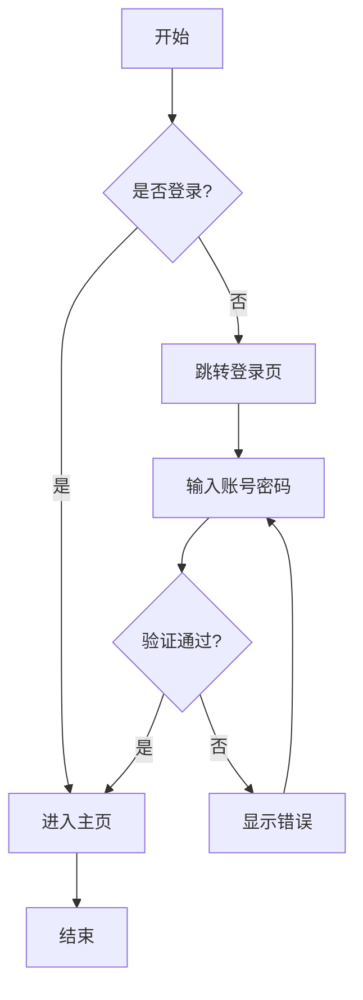
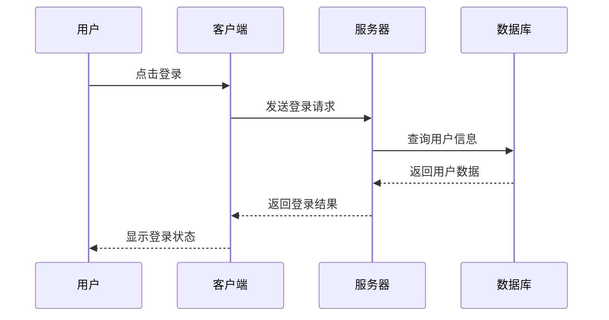
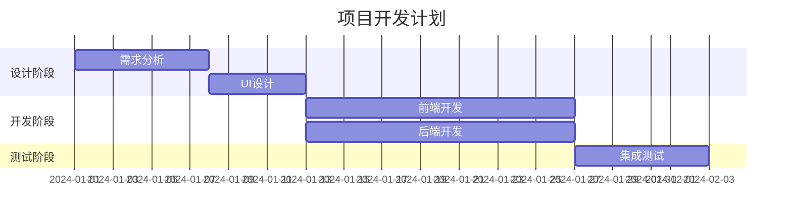
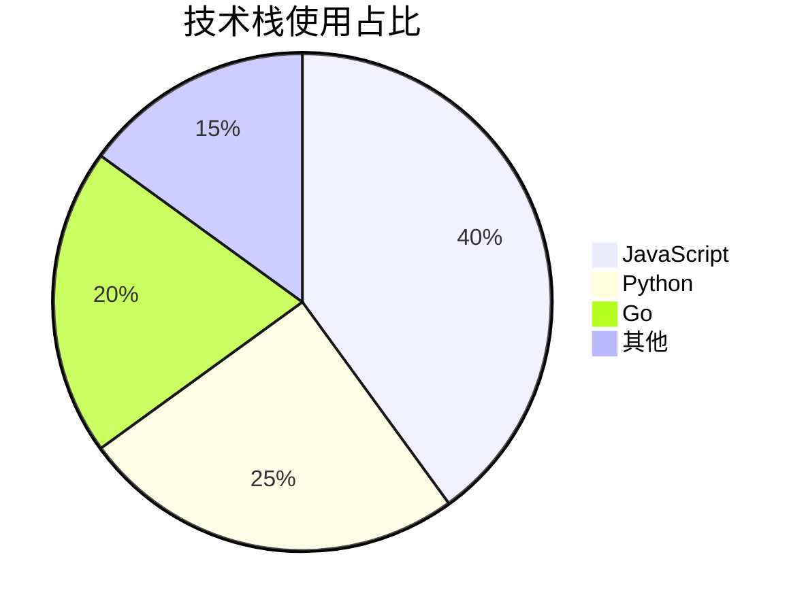

# 测试文档 - Mermaid 图表示例

这是一个包含多种 Mermaid 图表的测试文档。

## 流程图示例

```mermaid
flowchart TD
    A[开始] --> B{是否登录?}
    B -->|是| C[进入主页]
    B -->|否| D[跳转登录页]
    D --> E[输入账号密码]
    E --> F{验证通过?}
    F -->|是| C
    F -->|否| G[显示错误]
    G --> E
    C --> H[结束]
```

## 时序图示例

```mermaid
sequenceDiagram
    participant U as 用户
    participant C as 客户端
    participant S as 服务器
    participant D as 数据库

    U->>C: 点击登录
    C->>S: 发送登录请求
    S->>D: 查询用户信息
    D-->>S: 返回用户数据
    S-->>C: 返回登录结果
    C-->>U: 显示登录状态
```

## 甘特图示例

```mermaid
gantt
    title 项目开发计划
    dateFormat  YYYY-MM-DD
    section 设计阶段
    需求分析           :a1, 2024-01-01, 7d
    UI设计             :a2, after a1, 5d
    section 开发阶段
    前端开发           :b1, after a2, 14d
    后端开发           :b2, after a2, 14d
    section 测试阶段
    集成测试           :c1, after b1, 7d
```

## 饼图示例

```mermaid
pie title 技术栈使用占比
    "JavaScript" : 40
    "Python" : 25
    "Go" : 20
    "其他" : 15
```
